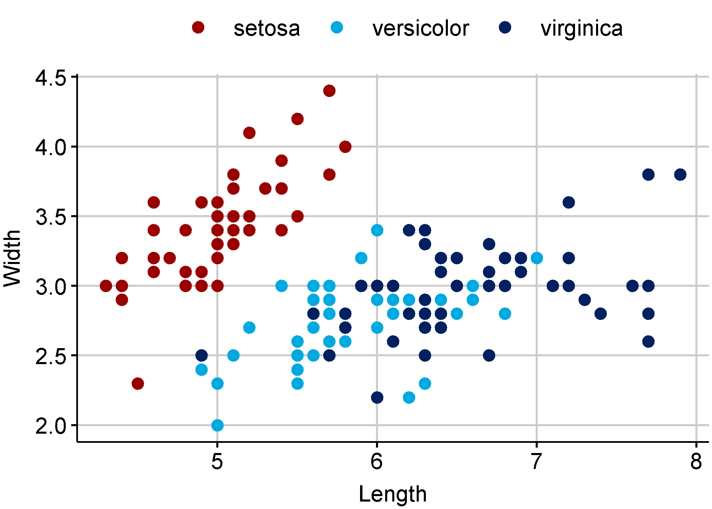

<!-- # Heading 1 is for section titles -->
<!-- ## Heading 2 is for subsection titles -->
<!-- ### Heading 3 is for figure titles -->
<!-- #### Heading 4 is for figure subtitles -->
<!-- [For Links](http://www.sgb.ch) -->

```{r setup, include=FALSE, warnings=FALSE}
#Load functions and set working directory
source("I:/ABT1/_Datenablage/3_R-Skripte/SGB_data_prep_functions.R")
library(gsgb)
library(knitr)
library(flextable) #für Word-Tabellen im SGB-Layout
library(officer)   #für Word-Tabellen im SGB-Layout

#Set up general knitr options
knitr::opts_chunk$set(echo = TRUE, warning=FALSE, message=FALSE, fig.width=3.5, fig.height=2.5, dpi=600)
# Working directory in knitr (uncomment next line if desired)
# knitr::opts_knit$set(root.dir="I:/ABT1/_Datenablage/3_R-Skripte/rmarkdown-Vorlagen")

# Set SGB ggplot theme
th <- theme_sgb()
theme_set(th)

# flextable SGB theme function
flextable_sgb <- function(x){
  x <- flextable(x)
  x <- colformat_num(x, big.mark="'", digits=0)
  x <- border_remove(x = x) 
  x <- bold(x, part="header")
  sb  <- fp_border(color="black", width=1)
  x <- hline_top(x, border=sb, part="header" )
  x <- hline_top(x, border=sb, part="body" )
  x <- hline_bottom(x, border=sb, part="body")
  return(x)
}
```

# Wenig Unterstüzung ausserhalb der SVP, starke Gegenmobilisierung: Weshalb die BGI scheiterte

## Starker Kontrast zwischen BGI- und MEI-Resultat

Im Gegensatz zur Masseneinwanderungsinitiative (MEI) fiel die Begrenzungsinitiative (BGI) auf breiter Front durch. Für die BGI reichte es nur zu einem Ja-Anteil von 38.3 Prozent bei der Stimmbevölkerung und 3.5 zu-stimmenden Ständen (Schwyz, Glarus, Tessin und Appenzell-Innerrhoden). Dagegen sorgten 6 Jahren zuvor 50.3 Prozent der Stimmbevölkerung und 12.5 Stände für eine knappe Annahme der MEI. 

Und hier ein Plot: 

### Plot Titel
#### (Plot Untertitel)
```{r plot1, echo=FALSE, fig.cap="Quelle: Fisher, R. A. (1936)"}
ggplot(data=iris,aes(x=Sepal.Length, y=Sepal.Width, col=Species)) + 
  geom_point()+
  labs(x="Length",y="Width")+
  scale_colour_manual(values = usecol(pal = pal_sgb_pref))

ggsave(file="plot.png")
```

Plots aus externer Datei:

### Plot aus externer Datei
#### (Plot Untertitel)
 

Und noch eine Tabelle:

### knitr-Tabelle
```{r tabelle, echo=FALSE}
tab <- matrix((1:8)*1000, ncol=4)
tab <- as.data.frame(tab)
rn <- c("a","b")
tab <-data.frame(rn, tab)
names(tab) <- c(" ",letters[1:4])
kable(tab, digits = 1, format.args = list(big.mark = "'", scientific = FALSE))
```


### flextab-Tabelle 
```{r tabelle2, echo=FALSE, ft.align="left"}
tab <- matrix((1:8)*1000, ncol=4)
tab <- as.data.frame(tab)
rn <- c("a","b")
tab <- data.frame(rn, tab)
names(tab) <- c(" ",letters[1:4])
flextable_sgb(tab)
```
